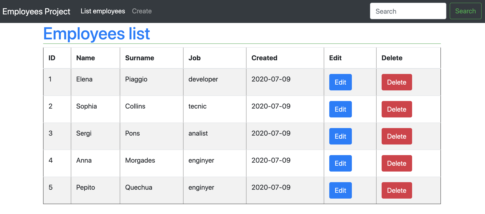

# Employee Management

## Objectius
- Conèixer un servei HTTP al complet 
- Primer contacte amb peticions web

## Description
En En aquesta pràctica aprendràs a crear peticions HTTP amb un CRUD (Create, Read, Update, Delete) al complet. Per això implementarem un patró d'arquitectura MVC amb repositoris. 
Els recursos d'aquesta activitat no tenen per què fer-se servir al 100% de la documentació.

## Enunciat:
- Crearem un programa de gestió d'empleats molt senzill on depenent de la feina de l'empleat se li assignarà un salari automàticament. 
D'un treballador identifiquem el nom i la seva feina, estaria bé tenir un identificador únic per aquest treballador. 
Les feines són fixes, és a dir ja estan definits en un ENUMERABLE. 
Depenent de la feina s'assignarà un salari a l'empleat un cop es crea.

#### NOTES:
1. El servidor ha de tenir ben definits els dominis i repositoris
2. El programa ha de tenir una web (molt senzilla) on introduir les dades i fer les crides del webservice
3. El domini ha de tenir el CRUD al complet. (Create, Read, Update, Delete)
4. Finalment crea una petició especial que busqui empleats per feina.

#### CONCEPTES A INVESTIGAR:
- Repositori
- Enumerable
- RCP (webservice)